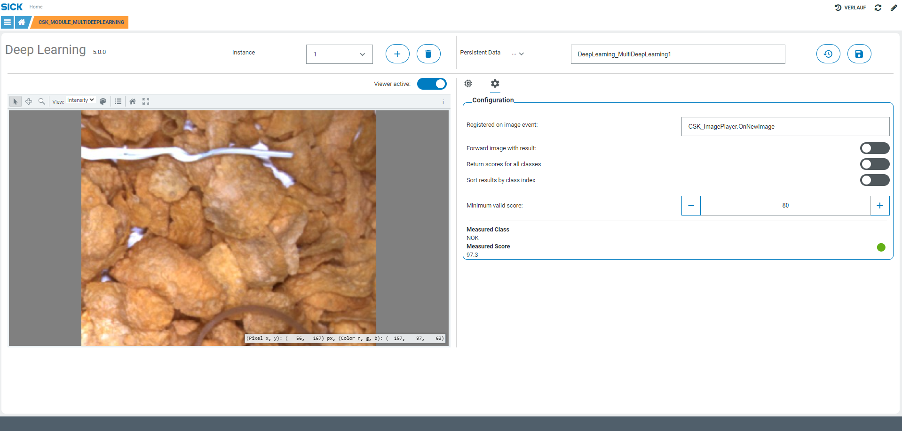

# CSK_Module_MultiDeepLearning

Module to setup single or multiple DeepLearning processing threads.

## How to Run

The app includes an intuitive GUI to upload/download DNN models and to edit configuration.
Processing can be triggered via event (needs to be registered) or as function call. See sample inside of the code.
For further information check out the [documentation](https://raw.githack.com/SICKAppSpaceCodingStarterKit/CSK_Module_MultiDeepLearning/main/docu/CSK_Module_MultiDeepLearning.html) in the folder "docu".

## Known issues
- 'handleOnNewImageProcessingScores' not supported on SIM1012 with firmware versions other than [2.1.0, 2.2.0, 2.2.1]

## Information

Tested on

|Device|Firmware|Module version
|--|--|--|
|SICK AppEngine|V1.5.0|V4.1.0|
|SIM 1012|V2.2.0|V4.1.0|

This module is part of the SICK AppSpace Coding Starter Kit developing approach.
It is programmed in an object oriented way. Some of these modules use kind of "classes" in Lua to make it possible to reuse code / classes in other projects.
In general it is not neccessary to code this way, but the architecture of this app can serve as a sample to be used especially for bigger projects and to make it easier to share code.
Please check the [documentation](https://github.com/SICKAppSpaceCodingStarterKit/.github/blob/main/docu/SICKAppSpaceCodingStarterKit_Documentation.md) of CSK for further information.

## Topics

Coding Starter Kit, CSK, Module, SICK-AppSpace, Multi, DeepLearning, Image, 2D
